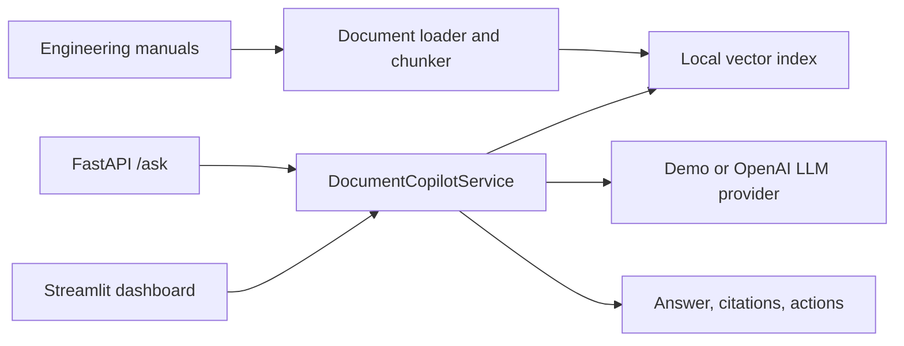

# AI Engineering Document Copilot

AI Engineering Document Copilot is a production-style RAG system for engineering manuals, maintenance procedures, and troubleshooting notes. It turns long technical documents into grounded answers with citations, maintenance actions, and a Streamlit control-room dashboard.

## Why This Matters

Maintenance teams often rely on large PDF manuals, site standards, and tribal knowledge during time-sensitive equipment events. This project demonstrates how a small retrieval and LLM service can make engineering documentation searchable, auditable, and easier to use without hiding the source context.

## Architecture



The shared `DocumentCopilotService` is the inference boundary. FastAPI and Streamlit both call the same service so ingestion, retrieval, citation formatting, and answer generation stay consistent.

## Tech Stack

- Python, FastAPI, Streamlit
- scikit-learn TF-IDF retrieval for a lightweight local vector index
- Pydantic request and response schemas
- Optional OpenAI chat provider
- Pytest behavior tests

## Features

- Demo engineering manuals for compressors, pumps, and conveyors
- Document chunking with source, section, equipment, and maintenance metadata
- Local persisted retrieval index under `indexes/vector_store`
- `GET /health`, `POST /ask`, `POST /ingest`, and `GET /documents`
- Direct Streamlit mode for Streamlit Community Cloud
- API mode for local production-style serving
- Dark operational dashboard with health cards, cited answers, and retrieved context

## Project Structure

```text
api/                  FastAPI app and schemas
app/                  Streamlit dashboard
data/                 Raw, processed, and runtime local files
docs/sample_manuals/  Demo engineering manuals
indexes/vector_store/ Local retrieval index artifacts
scripts/              Demo document and ingestion scripts
src/                  Shared config, document, retrieval, LLM, and service logic
tests/                Focused behavior and smoke tests
screenshots/          README screenshots
```

## Local Setup

```powershell
py -m venv .venv
.\.venv\Scripts\Activate.ps1
pip install -r requirements.txt
py -m scripts.create_demo_docs
py -m scripts.ingest_documents
py -m pytest tests
```

## Local API Workflow

```powershell
$env:COPILOT_MODE="api"
py -m uvicorn api.main:app --reload --port 8000
```

In another terminal:

```powershell
$env:COPILOT_MODE="api"
py -m streamlit run app/dashboard.py
```

### Local Port Conventions

Use fixed local ports when running multiple portfolio projects side by side:

```text
Project 1 Predictive Maintenance: 8501
Project 2 Document Copilot: 8602
FastAPI backend: 8000 or 8010
```

Run this project on its fixed Streamlit port:

```powershell
$env:COPILOT_MODE="direct"
py -m streamlit run app/dashboard.py --server.port 8602
```

Example API call:

```powershell
Invoke-RestMethod -Method Post `
  -Uri http://localhost:8000/ask `
  -ContentType "application/json" `
  -Body '{"question":"What should I check when compressor bearing temperature is high?","top_k":4}'
```

## Streamlit Cloud Direct Deployment

Deploy only the Streamlit app:

```text
Repository: owner/AI-Engineering-Document-Copilot
Branch: main
Main file path: app/dashboard.py
```

Set Streamlit secrets:

```toml
COPILOT_MODE = "direct"
LLM_PROVIDER = "demo"
```

Direct mode loads the same shared service inside Streamlit and does not require a hosted FastAPI backend.

## Environment Variables

```text
COPILOT_MODE=api|direct
API_BASE_URL=http://localhost:8000
LLM_PROVIDER=demo|openai
OPENAI_API_KEY=...
EMBEDDING_MODEL=local-tfidf
CHAT_MODEL=demo-grounded-extractor
VECTOR_STORE_PATH=indexes/vector_store
DOCUMENT_SOURCE_PATH=docs/sample_manuals
```

Environment variables are read first. Streamlit secrets are used as a fallback, and missing secrets are handled safely.

## API Examples

`GET /health` returns service mode, provider, document count, chunk count, and index paths.

`POST /ask` accepts:

```json
{
  "question": "What should I inspect after repeated conveyor motor trips?",
  "top_k": 4
}
```

The response includes an answer, confidence, maintenance actions, citations, retrieved context, mode, and provider.

## Screenshots

Screenshots should be added after the first local dashboard run. Suggested captures:

- Dashboard home state
- Answer with citations
- API docs at `/docs`

## Testing

```powershell
py -m pytest tests
```

The tests cover mode parsing, chunking, metadata preservation, retrieval relevance, service response shape, and FastAPI smoke behavior.

## Future Improvements

- PDF parsing with page-level citation support
- Chroma or FAISS backend for larger document sets
- Role-based document collections
- Operator feedback loop for answer quality
- SQLite audit history for questions and cited sources
- Evaluation set for retrieval precision and grounded answer quality

## CV Bullet Points

- Built a production-style RAG copilot for engineering manuals with FastAPI, Streamlit, and reusable service-layer architecture.
- Implemented local document ingestion, metadata-rich chunking, persisted retrieval, cited answers, and maintenance action extraction.
- Designed dual deployment modes for local API serving and Streamlit Cloud direct execution.

## Current Limitations

- The default retriever uses TF-IDF for portability rather than dense embeddings.
- Demo mode generates extractive grounded answers and does not replace engineering review.
- OpenAI mode requires a valid API key and should be validated with site-specific manuals before operational use.
- Sample manuals are synthetic and intended for portfolio demonstration only.
