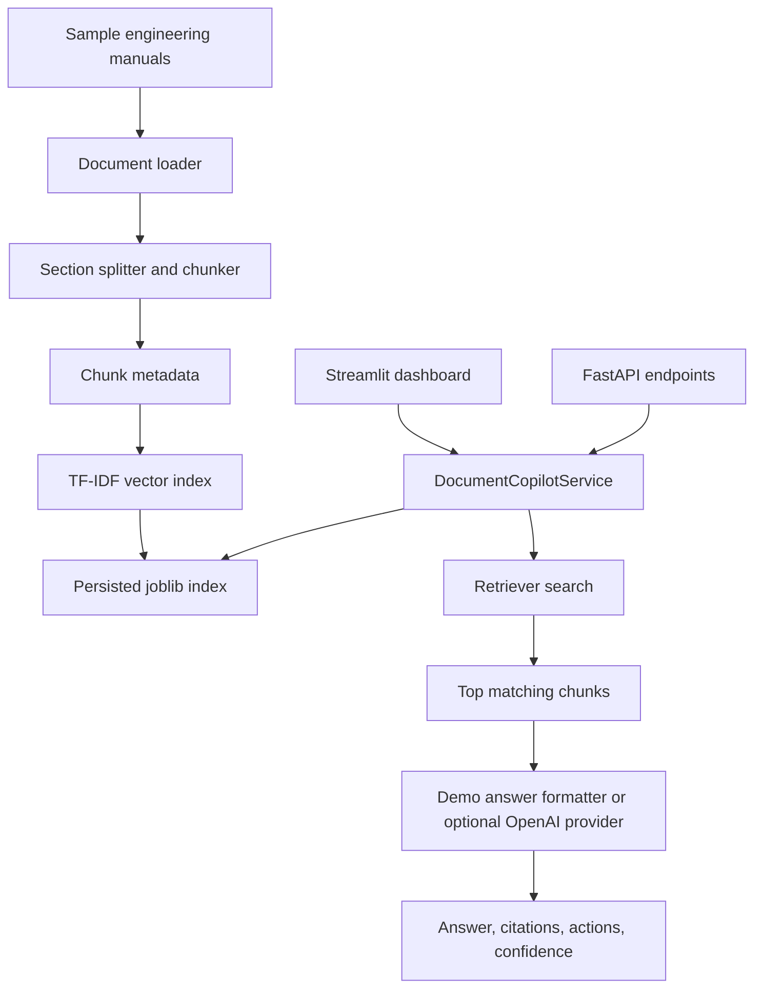

# Architecture

## System Architecture

The project is built as a small layered RAG application:

- `docs/sample_manuals/` contains the demo engineering manuals.
- `src/documents/` loads, splits, and tags documents.
- `src/retrieval/` builds and searches a local TF-IDF retrieval index.
- `src/llm/` contains answer provider logic.
- `src/services/` exposes the main `DocumentCopilotService`.
- `api/` provides FastAPI endpoints.
- `app/` provides the Streamlit dashboard.

The main design decision is that both FastAPI and Streamlit call the same service layer. This avoids duplicating retrieval and answer logic in the UI.

## Data Flow

### Ingestion Flow

1. Demo manuals are loaded from `docs/sample_manuals/`.
2. Markdown headings are used as section boundaries.
3. Section text is split into word chunks.
4. Each chunk receives metadata:
   - source document
   - section
   - synthetic page/section reference
   - equipment type
   - maintenance category
5. A TF-IDF vectorizer turns chunks into a sparse matrix.
6. The vectorizer, matrix, and chunk metadata are saved with `joblib`.

### Question Answering Flow

1. User submits a question in Streamlit or through `POST /ask`.
2. `DocumentCopilotService.ask()` loads the index if needed.
3. The question is transformed by the same TF-IDF vectorizer.
4. Cosine similarity ranks the document chunks.
5. The top results are sent to the configured answer provider.
6. The response includes:
   - answer
   - confidence
   - maintenance actions
   - citations
   - retrieved context
   - mode and provider metadata

## Main Components

### Streamlit Dashboard

`app/dashboard.py` is the deployed user interface. It shows system health, document count, chunk count, provider mode, the question input, answer panel, citations, and retrieved context.

### FastAPI Backend

`api/main.py` exposes:

- `GET /health`
- `POST /ask`
- `POST /ingest`
- `GET /documents`

This is useful for local production-style development, API testing, and demonstrating that the system is not only a Streamlit script.

### Service Layer

`src/services/document_copilot.py` is the core application boundary. It owns demo readiness, ingestion, index loading, question answering, health checks, and document listing.

### Retrieval Layer

`src/retrieval/index.py` implements a local TF-IDF index using scikit-learn. This is lightweight and easy to deploy, but it is less semantically powerful than dense embeddings.

### Answer Provider Layer

`src/llm/providers.py` has two modes:

- `demo`: rule-based answer formatting from retrieved chunks.
- `openai`: optional call to an OpenAI chat model if configured.

The deployed demo should be explained as local retrieval plus demo answer formatting unless OpenAI mode is actually enabled.

## Mermaid Diagram



## Local vs Deployed Workflow

### Local API Workflow

Local API mode demonstrates a backend service:

```powershell
$env:COPILOT_MODE="api"
py -m uvicorn api.main:app --reload --port 8000
```

Then Streamlit can call the API:

```powershell
$env:COPILOT_MODE="api"
py -m streamlit run app/dashboard.py --server.port 8602
```

This is closer to a production architecture because the UI and backend are separate.

### Streamlit Cloud Workflow

The deployed workflow uses direct mode:

```toml
COPILOT_MODE = "direct"
LLM_PROVIDER = "demo"
```

In direct mode, Streamlit loads `DocumentCopilotService` directly. This avoids needing a separately hosted FastAPI service on Streamlit Community Cloud.

## Why This Architecture Makes Sense

The architecture keeps the demo deployable while still showing production-oriented thinking. The service layer is the important part: if the project later moves from Streamlit Cloud to a full cloud backend, the retrieval and answer logic can stay mostly the same.

